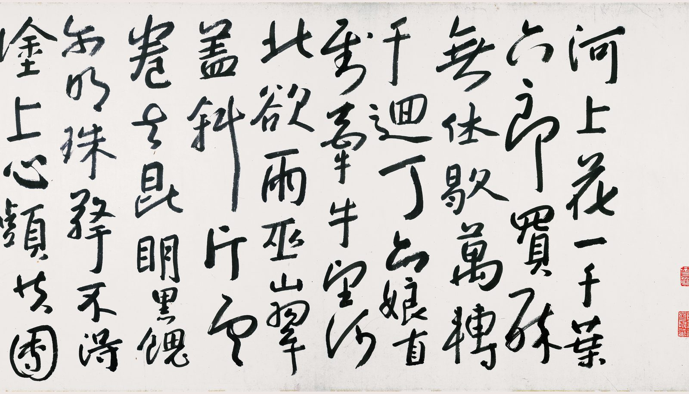
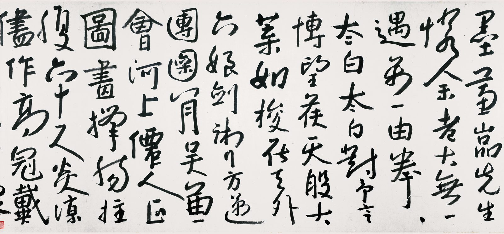
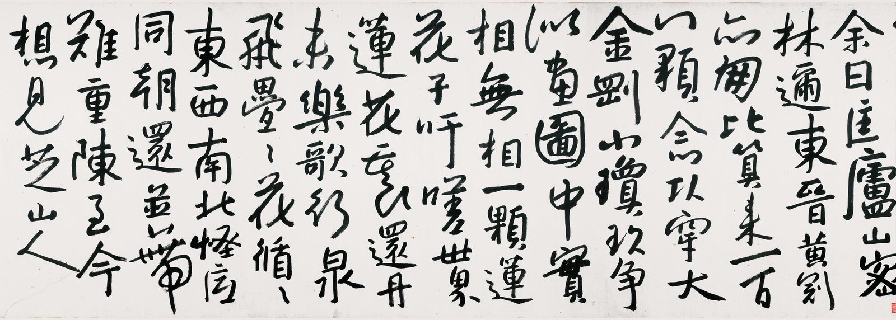
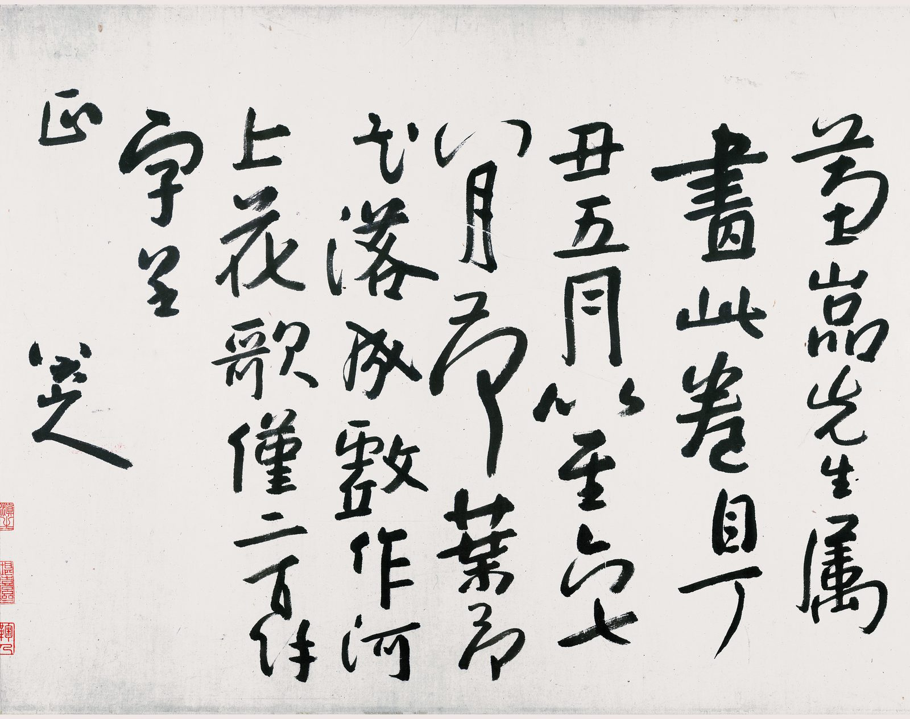

::: {.plate}

:::

河上花，一千葉，六郎買醉無休歇。\
萬轉千迴丁六娘，直到牽牛望河北。\
欲雨巫山翠蓋斜，片雲卷去昆明黑。\
饋而明珠擎不得，塗上心頭共團墨。\
蕙嵒先生憐余老大無一遇，萬一由拳拳太白。\
太白對予言：博望侯，天般大，葉如梭，在天外，六娘劍術行方邁。\
團圞八月吳兼會，河上仙人正圖畫。\
撐腸拄腹六十尺，炎涼盡作高冠戴。\
余曰：匡廬，山密林邇，東晉黃冠亦朋比，算來一百八顆念頭穿。\
大金剛，小瓊玖，爭似圖畫中。\
實相無相，一顆蓮花子。\
吁嗟世界蓮花裏。\
還舟未？樂歌行，泉飛疊疊花循循。\
東西南北怪底同，朝還並蒂難重陳，至今想見芝山人。

---

蕙嵒先生屬畫此卷，自丁丑五月以至六、七、八月，荷葉荷花落成，戲作河上花歌僅二百餘字呈正。

<!--
出處：
- 歌全文（卷尾自賦）：據 https://www.51sdj.com/show.php?do=original&id=1675 釋文（「還舟未」「饋而明珠」依此；其「團八月」一句，光明日報 https://epaper.gmw.cn/gmrb/html/2022-07/22/nw.D110000gmrb_20220722_1-15.htm 與中國青年作家報 https://qnzj.cyol.com/html/2024-08/20/nw.D110000qnzjb_20240820_2-04.htm 兩處釋文並作「團圞八月」，今從之）。南開大學〈八大山人《河上花圖卷》序〉 https://art.nankai.edu.cn/2013/0630/c11137a112361/page.htm 作「撐腸挂腹」「蓬花裏」「還丹未」，光明日報作「饋爾明珠」「爭似畫圖中」「還丹未」，雅昌 https://m-news.artron.net/news/20250408/n1620209.html 作「還舟未」，皆異釋，本頁取「還舟」「而」「圖畫」不改。
- 卷末自跋「蕙嵒先生屬畫此卷……僅二百餘字呈正。八大山人」：同上 51sdj 頁，各本同；「屬」字原釋作「瞩（属）」，取「屬」。
- 圖：../畫/河上花圖.jpg（卷首），畫卷另有一頁 ../畫/河上花圖.md。舊圖 河上花圖-detail.jpg 為另一件花鳥手卷局部，非此卷，全站無一頁引之，2026-09-07 已刪。
- 2026-09-07 只留本人語：刪歌後自述三段（本站所撰，六郎、丁六娘、博望侯典故釋語及「還舟未。未」等），刪「——」分隔，description 改用跋語。
- 2026-09-09 定日期為 1697-09（原作 1697-01-01，月為本站所補）。卷末自跋「自丁丑五月以至六、七、八月，荷葉荷花落成，戲作河上花歌」——歌作於卷成之時，即丁丑八月。康熙三十六年八月朔至晦，中央研究院曆算得西元一六九七年九月十五日至十月十三日；日不可知，繫其月為 1697-09。
- 2026-09-10 刪款末署名：本站即八大山人之地，文末再署一名無所增益，故去之；款中他語一仍其舊。
- 2026-09-10 換圖：本頁是歌，故取歌本身之圖版，不復用《河上花圖》卷首一段。舊圖為卷之最右端，卷首荷葉初起處，通幅無此歌一字；歌題在卷之最左端。讀者見圖而信歌在其中，是本站誤導之。今易為卷末自賦《河上花歌》之圖版四段，維基共享資源 File:清 朱耷 河上花圖 跋文 1 1.jpg 至 1 4.jpg（原尺寸各 11834×6689、14400×6689、18700×6689、8467×6689 像素，本站取寬 3840 之衍生檔轉存），標記為 PD-Art（公有領域藝術品攝影） https://commons.wikimedia.org/wiki/File:%E6%B8%85_%E6%9C%B1%E8%80%B7_%E6%B2%B3%E4%B8%8A%E8%8A%B1%E5%9C%96_%E8%B7%8B%E6%96%87_1_1.jpg 。四段依卷次自右而左為序：首段起「河上花，一千葉，六郎買醉無休歇」，正本頁首句；末段收於自跋「蕙嵒先生屬畫此卷，自丁丑五月以至六、七、八月……」。2026-09-10 就圖逐字覆核首段起句與末段跋語，與本頁所錄相合；「屬畫」之「屬」字圖上明白，非「囑」，前記依釋文所改為是。
- 影像：河上花歌_1.jpg，維基共享資源 File:清 朱耷 河上花圖 跋文 1 1.jpg（ https://commons.wikimedia.org/wiki/File:%E6%B8%85_%E6%9C%B1%E8%80%B7_%E6%B2%B3%E4%B8%8A%E8%8A%B1%E5%9C%96_%E8%B7%8B%E6%96%87_1_1.jpg ，原檔 11834×6689，Wmr-bot 2021-05-13 上傳，來源欄僅作「115.com」，藏館欄 Tianjin Museum）之 3840 像素衍生檔（ https://thumb.wikimedia.org/wikipedia/commons/thumb/6/6a/%E6%B8%85_%E6%9C%B1%E8%80%B7_%E6%B2%B3%E4%B8%8A%E8%8A%B1%E5%9C%96_%E8%B7%8B%E6%96%87_1_1.jpg/3840px-%E6%B8%85_%E6%9C%B1%E8%80%B7_%E6%B2%B3%E4%B8%8A%E8%8A%B1%E5%9C%96_%E8%B7%8B%E6%96%87_1_1.jpg ）。2026-09-13 換用維基原檔，本站依例裁至長邊 6000，得 6000×3391。所攝為卷末自賦《河上花歌》起首一段，右起「河上花一千葉六郎買醉無休歇」至左末「塗上心頭共團」，「墨」字在次段；右緣有朱文鑑藏印二方，非八大印。
- 影像：河上花歌_2.jpg，同上 File:清 朱耷 河上花圖 跋文 1 2.jpg（ https://commons.wikimedia.org/wiki/File:%E6%B8%85_%E6%9C%B1%E8%80%B7_%E6%B2%B3%E4%B8%8A%E8%8A%B1%E5%9C%96_%E8%B7%8B%E6%96%87_1_2.jpg ，原檔 14400×6689）之 3840 像素衍生檔（ https://thumb.wikimedia.org/wikipedia/commons/thumb/7/73/%E6%B8%85_%E6%9C%B1%E8%80%B7_%E6%B2%B3%E4%B8%8A%E8%8A%B1%E5%9C%96_%E8%B7%8B%E6%96%87_1_2.jpg/3840px-%E6%B8%85_%E6%9C%B1%E8%80%B7_%E6%B2%B3%E4%B8%8A%E8%8A%B1%E5%9C%96_%E8%B7%8B%E6%96%87_1_2.jpg ）。2026-09-13 換用維基原檔，本站依例裁至長邊 6000，得 6000×2787。所攝承前段，右起「墨」「蕙嵒先生憐余老大無一遇」至左末「炎涼盡作高冠戴」；左下角露鑑藏印一角。
- 影像：河上花歌_3.jpg，同上 File:清 朱耷 河上花圖 跋文 1 3.jpg（ https://commons.wikimedia.org/wiki/File:%E6%B8%85_%E6%9C%B1%E8%80%B7_%E6%B2%B3%E4%B8%8A%E8%8A%B1%E5%9C%96_%E8%B7%8B%E6%96%87_1_3.jpg ，原檔 18700×6689）之 3840 像素衍生檔（ https://thumb.wikimedia.org/wikipedia/commons/thumb/3/3e/%E6%B8%85_%E6%9C%B1%E8%80%B7_%E6%B2%B3%E4%B8%8A%E8%8A%B1%E5%9C%96_%E8%B7%8B%E6%96%87_1_3.jpg/3840px-%E6%B8%85_%E6%9C%B1%E8%80%B7_%E6%B2%B3%E4%B8%8A%E8%8A%B1%E5%9C%96_%E8%B7%8B%E6%96%87_1_3.jpg ）。2026-09-13 換用維基原檔，本站依例裁至長邊 6000，得 6000×2146。所攝承前段，右起「余曰匡廬山密林邇」至左末「至今想見芝山人」，歌至此終；右下角有小印一方。
- 影像：河上花歌_4.jpg，同上 File:清 朱耷 河上花圖 跋文 1 4.jpg（ https://commons.wikimedia.org/wiki/File:%E6%B8%85_%E6%9C%B1%E8%80%B7_%E6%B2%B3%E4%B8%8A%E8%8A%B1%E5%9C%96_%E8%B7%8B%E6%96%87_1_4.jpg ，原檔 8467×6689）之 3840 像素衍生檔（ https://thumb.wikimedia.org/wikipedia/commons/thumb/a/a3/%E6%B8%85_%E6%9C%B1%E8%80%B7_%E6%B2%B3%E4%B8%8A%E8%8A%B1%E5%9C%96_%E8%B7%8B%E6%96%87_1_4.jpg/3840px-%E6%B8%85_%E6%9C%B1%E8%80%B7_%E6%B2%B3%E4%B8%8A%E8%8A%B1%E5%9C%96_%E8%B7%8B%E6%96%87_1_4.jpg ）。2026-09-13 換用維基原檔，本站依例裁至長邊 6000，得 6000×4740。所攝為卷末自跋全段，右起「蕙嵒先生屬畫此卷自丁丑五月以至六七八月荷葉荷花落成戲作河上花歌僅二百餘字呈正」，末行署「八大山人」；左緣鑑藏印三方，非八大印。
- 影像四段之共同事項：四檔皆同一上傳者、同日、同來源「115.com」、同高 6689，四段橫寬相加 53401 像素，依卷次自右而左相接（前段末字「團」與次段首字「墨」相續），合為卷末自賦與自跋之全幅；四檔皆該衍生檔經本站重存；2026-09-13 起改用各檔維基原始檔（各按上列尺寸裁至長邊 6000），位元組不同。未見四檔在原卷上之精確接縫，故各段是否毫無重疊、有無缺行，本站未能覆核，唯就文字讀之，四段首尾相銜，三十七行歌與自跋無闕。共享資源另有一組 File:清 朱耷 河上花圖1 跋文 3.jpg 等（同來源、同藏館欄），本頁未用。此四檔非天津博物館所出：共享資源之來源欄僅記「115.com」（網盤），原掃描出自何處無可考；權利標記為 {{PD-Art|PD-old-100-1923}}，其 permission 文字作「This is a faithful photographic reproduction of a two-dimensional, public domain work of art. […] The official position taken by the Wikimedia Foundation is that "faithful reproductions of two-dimensional public domain works of art are public domain". This photographic reproduction is therefore also considered to be in the public domain in the United States. In other jurisdictions, re-use of this content may be restricted」——是維基媒體基金會之見解，非天津博物館之授權。天津博物館館頁 https://www.tjbwg.cn/cn/collectionInfo.aspx?Id=2616 著錄「清 朱耷 河上花图卷 清康熙三十六年（1697） 纸本 墨笔 纵47厘米 横1292.5厘米」並言「图后有朱耷以行书自题歌行体诗《河上花歌》」，無單獨之影像權利聲明，僅頁尾「©1998-2026 天津博物馆版权所有」；館頁所嵌自載圖 http://www.tjbwg.cn/UserFiles/DownFiles/sys/2012-09-20/b_清 朱耷 河上花图卷-20120920113140718.jpg 未能取得館方影像以比對。
- 2026-09-23 圖下尺寸注刪去：同日所加「全卷縱四七公分　橫一二九二．五公分」是畫心之數，置於歌之圖版下有誤導，且所附出處誤引上海博物館；歌紙之尺寸未見著錄，故不注。畫心尺寸見 畫/河上花圖。
-->
