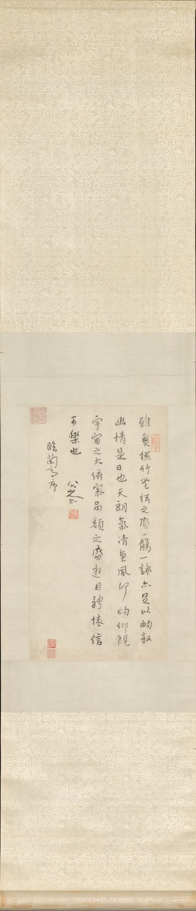

::: {.plate}

縱四六．七公分　橫二五．四公分
:::

臨《蘭亭序》。

印：「遙屬」、「閒夫」。

<!--
- 正文、款識、鈐印皆依館方著錄：紐約大都會藝術博物館藏，1989.363.136，館方中文品名「清　朱耷（八大山人）　行書節錄王羲之蘭亭序　軸」，英文題 After Wang Xizhi's "Preface to the Orchid Pavilion Gathering Collection"，約 1694–96。「Signatures, Inscriptions, and Markings」欄錄「Artist's inscription and signature (5 columns in semi-cursive script)：雖無絲竹管絃之盛，一觴一詠亦足以暢敘幽情。是日也，天朗氣清，惠風何[和]暢。仰觀宇宙之大，俯察品類之盛，遊目騁懷，信可樂也。八大山人書，臨《蘭亭序》。／Artist's seals：Yaozhu 遙屬、Xianfu 閒夫」。館頁 https://www.metmuseum.org/art/collection/search/49144 有防爬蟲關卡，見存檔 https://web.archive.org/web/20220119183115/https://www.metmuseum.org/art/collection/search/49144 ；開放 API https://collectionapi.metmuseum.org/public/collection/v1/objects/49144 。館方未標印之朱白，故不記。
- 這是他節錄的本子，不是《蘭亭序》。本幅正文五十字，傳世《蘭亭》三百二十四、五字，所書約當七分之一；館方品名亦作「節錄」。「惠風何暢」之「何」是他所書（館方於釋文中夾註 [和] 以示與通行本異），非誤錄；「俯察品類之盛」下逕接「遊目騁懷」，省去「所以」及「足以極視聽之娛」九字。故此頁只錄他寫下的字，通行本全文不錄。
- 圖版五行，與館方所稱五行相符：行一「雖無絲竹管弦之盛一觴一詠亦足以暢敘」十七字、行二「幽情是日也天朗氣清惠風何暢仰觀」十五字、行三「宇宙之大俯察品類之盛遊目騁懷信」十五字、行四「可樂也」三字接八大山人花押及印一，行五「臨蘭亭序」四字。2026-09-07 覆核。
- 參本站 書/臨河集序：他在那一幅的自識裏正論《定武本》三百廿五字而《臨河序》止得百字之別，與此幅所為是同一件事。
- 2026-09-07 錄入正文。舊稿以「所臨為王羲之文，不錄」刪之——按本站體例，他親手選寫、且經其增損之文，是他的取捨，當錄；且館方所錄正是此軸上的字，非通行本之文。舊稿 description 館藏尺寸繫年、按語（北京故宮另本、冊頁本比較）、著錄仍不錄。
- 2026-09-10 款識逕錄其文，不加「款識：」之目、不加引號；「八大山人書」四字為署名，刪，存「臨《蘭亭序》」五字，理同 書/臨河集序。
- 2026-09-10 此軸止五十字，通行《蘭亭序》三百廿餘字，其餘何在？追究之下，問題本身要換一個問法：他一生寫「蘭亭」不下十數遍，而所寫的多半不是此軸這篇文字。
- 2026-09-10 其一，數目。弗利爾美術館藏《臨河集序》冊頁（F1998.31，約丁丑一六九七，王方宇舊藏）館方解說云：「Between 1693 and 1700, Bada produced at least twelve dated and undated versions of this text using various formats—hanging scroll, single album leaf, multiple album leaves, and folding fan—making it both the most commonly quoted text in his extant corpus and the single text with which he conducted the most widely varied calligraphic experiments.」 https://asia-archive.si.edu/object/F1998.31/ 王方宇〈八大山人的書法〉之〈八大山人寫的《臨河敘》〉一節（《名家翰墨·八大山人法書集（二）》，一九九八年四月，頁 64–67；英文本見 Wang Fangyu & Barnhart, *Master of the Lotus Garden*, Yale, 1990, Appendix C）所計相合：癸酉（一六九三）至庚辰（一七〇〇）八年間，署八大山人款而書此文者十八、九件，定其真者十二件（《名家翰墨·八大山人法書集（二）》一九九八年四月，頁 64–67；《八大山人全集》第五卷頁 1205）。十二件為：一六九三《書畫冊》第八、九、十頁（上海博物館）、一六九六小春冊頁一頁（南京十竹齋藝術研究部）、一六九七大軸（149.5×89.5 公分，李仿陶、歐初舊藏，二〇二五年七月西泠春拍成交 https://m-news.artron.net/20250726/n1143056.html ）、一六九七《八大山人書法冊》七頁中之一頁（王方宇舊藏）、一六九八扇面、一六九八《戊寅書畫冊》一頁（舊金山亞洲藝術博物館）、一六九九春日大立軸（普林斯頓大學美術館）、一六九九秋七月為聚升作四頁冊（上海博物館）、一六九九八月既望《蘭亭詩畫冊》前六開（張大千大風堂舊藏，松林桂月遞藏，二〇一九年佳士得香港 17209 場 lot 1000 https://www.christies.com.cn/zh/lot/lot-6238658 ）、一七〇〇立夏《山水花鳥冊》（張大千舊藏）、一七〇〇至日原大立軸剪裱為六條屏（東京國立博物館，日本文化廳資料庫 https://online.bunka.go.jp/heritages/detail/508479 ）、無紀年立軸內容不全（北京故宮博物院）。十二件無一手卷。
- 2026-09-10 其二，文本。上列十二件所書皆《臨河序》，非此軸之文。《臨河序》見《世說新語·企羨》劉孝標注所引王羲之《臨河敘》 https://zh.wikisource.org/zh-hant/世說新語/企羨 ，止百餘字，與《定武》系統之通行《蘭亭序》三百廿五字是兩篇。他自己在 書/臨河集序 一幅的自識中正辨此事。啟功〈蘭亭的迷信應該破除〉謂所見八大書《臨河序》八九本，文皆從《世說》注，未有從《蘭亭》帖本者。故所謂「其餘」，於《臨河序》而言並無其餘——十二件所書幾乎都是那一百餘字的全篇。
- 2026-09-10 其三，此軸不在其列。所據是通行本，非《臨河序》。此結論本站未見前人明言，姑存之，證有三。一曰次第：《臨河敘》作「是日也，天朗氣清，惠風和暢，娛目騁懷，信可樂也。雖無絲竹管絃之盛，一觴一詠，亦足以暢敘幽情矣」，「是日也」在前而「雖無」在後；此軸「雖無」在前、「是日也」在後，與通行本合。二曰增字：「仰觀宇宙之大，俯察品類之盛」十二字為通行本所有，《臨河敘》通篇無之，而此軸有之。三曰異文：他所書《臨河序》諸本句末一律作「洵可樂也」（佳士得 lot 1000 釋文、書法空間錄丁丑一軸 http://9610.com/bada/53.htm 並同），此軸則作通行本之「信可樂也」。按異文一節非本站臆說，啟功〈蘭亭的迷信應該破除〉早已指出，白謙慎文引其語云：「所寫的《臨河序》不下八九本，其中影印本約有四五本，文詞一律都是《世說新語注》中的那一篇，而不是多一百六十七字的那一篇。文中也有幾處和今本《世說新語》不同，如『此地有崇山峻領』八大山人寫本作『此地迺峻領崇山』，又『惠風和暢』作『惠風何暢』，『信可樂也』作『洵可樂也』。值得注意的是各本一律是這樣，當然不是偶然一次筆誤。」——啟功所舉三處異文，正是本站據以別此軸於彼諸本者。本站所自為者，僅「此軸從通行本」一結論而已。
- 2026-09-10 「惠風何暢」非一時筆誤。他所書《臨河序》諸本亦皆作「惠風何暢」（同上二處），是其習讀如此，館方於釋文中夾註 [和]，正以其異於通行本。此軸雖從通行本之次第與文句，而「何」字仍其舊習。
- 2026-09-10 又，書法空間著錄此軸繫一「疑」字 https://www.9610.com/bada/1.htm ，即疑非真蹟；大都會博物館館頁則無保留之詞。二說並存，本站不能斷，記之。
- 2026-09-10 通行本全文之作，僅一說可徵而未足信：八大山人紀念館（南昌）藏《八大山人蘭亭序》，顧村言〈觀展記｜在南昌，走近 400 歲的八大山人（上）〉（2026-07-13，八大山人文獻館轉載 https://bdsrwxg.com/index.php?a=index&aid=587&c=View&m=home ）謂「是目前所見唯一的《蘭亭序》全文創作本」。此觀展者之語，非館方著錄，未見釋文與尺寸，且王方宇二〇〇〇年之目無此件，姑記以俟考。此外北京故宮博物院藏《朱耷行書蘭亭序軸》，文物號新 00092780，紙本行書，縱 174.5、橫 52.1 公分，款署「八大山人」，鈐「在芙山房」「八大山人」白文方印，引首「黃竹園」白文方印，本幅左下張大千藏印「藏之大千」，外簽張大千題「八大山人臨蘭亭。大風堂永遠供養」 https://www.dpm.org.cn/collection/handwriting/233536.html ——館方名之曰《蘭亭序》而云節錄，然其所記異文「『此地有』寫為『此地迺』」正是《臨河敘》之文，王方宇亦列之於《臨河序》十二件之末，是館名從俗，其實仍《臨河序》。廣州藝術博物院藏《節錄蘭亭序》，紙本 202.5×75.5 公分，款「丁丑春日臨之，八大山人」（書法空間 http://www.9610.com/bada/08.htm ，釋文未刊），當亦同此，未能覆核。
- 2026-09-10 附記：《蘭亭詩畫冊》款中「茲漫臨《蘭亭》一卷」之「一卷」，非別有手卷。該冊原十八開，前六開即《臨河集序》，後十二開為書畫對題；松林桂月得之而析為二，十二開改裱六條屏，二〇一八年佳士得 17461 場 lot 8003 售出 https://www.christies.com.cn/zh/lot/lot-6181134 ，前六開則遲至二〇一九年始出。張珩《木雁齋書畫鑒賞筆記》著錄猶云「紙本六頁……今與詩畫六頁冊合裝」，是原為一物。前此本站 書/臨河集序 注引此款而未及此，故補。
- 2026-09-10 更深一層：他所謂「臨」，未必真有所臨。白謙慎〈從八大山人臨《蘭亭序》論明末清初書法中的臨書觀念〉（華人德、白謙慎編《蘭亭論集》，蘇州大學出版社，二〇〇〇年，頁 294–320；網上見 https://www.163.com/dy/article/I6VPTM1A0514B0N8.html 、 https://www.sohu.com/a/492885054_121124710 ）舉一鐵證：翁萬戈舊藏、今歸波士頓美術館之一七〇二年《八大山人法書冊》（館藏號 2018.2868.1–19，翁氏家族捐贈 https://collections.mfa.org/objects/671712/after-the-ancients--running-script-calligraphy ），其中數開標明臨張芝、鍾繇、王羲之、褚遂良、虞世南，第四開款曰「臨王逸少」——而各開文字皆錄自唐張懷瓘《書斷》。張懷瓘晚於王羲之數百年，羲之何從書其書論？白氏因斷：「此處八大山人所『臨』的作品，並不是歷史上存在過的法帖，他只是根據自己理解中的這幾位書家的筆意抄錄了一些文字，便稱是『臨』了這些書法家的作品……既然八大山人可以鈔一段唐人的文字而又聲稱『臨』了王羲之，他又為何不可鈔《世說新語》中的『臨河序』並聲稱自己是『臨』了《蘭亭序』呢？因此，所謂『更碑室一本』和『弁山寶物』云云，很可能就如傅山的《郭有道碑》，是一個假託的遊戲。」據此，則 書/臨河集序 自識中那個「較山人所臨字大」的碑室本，未必實有其物。
- 2026-09-10 白氏此文之大旨，非考據而在觀念：明末清初之「臨」，已非摹古以求似，而是「臨書人通過對傳統經典任意改造、肢解、拼湊、假託，從而掌握在與觀書人遊戲中的操縱權」——董其昌以楷帖臨作草書，王鐸割裂拼湊法帖，傅山假託《郭有道碑》，八大此舉正在其列。白氏又據王方宇之校，謂諸本文字實有小異，非如啟功所云「各本一律」，因疑八大或竟是「用自己的書體把背在腦中的《臨河序》書寫出來，然後稱之為『臨』」。若然，則此軸與彼十二本之別，亦不過同一遊戲之兩種下法而已。
- 2026-09-10 東京國立博物館《行書臨河序六屛》館藏號 TB-1634，該館所藏八大山人凡三件，餘二為《草書七言絕句軸》（TB-1648）、《行書送李愿歸盤谷序軸》（TB-1447），館頁 https://colbase.nich.go.jp/collection_items/tnm/TB-1634?locale=ja 。二〇二六年一月四日至二月八日「明末清初の書畫——八大山人生誕四百年記念」展出，為第四十四號。
- 2026-09-10 弗利爾冊頁（F1998.31）訖於「故列敘時人，錄其所述」，即《臨河序》之末。館方題作 Excerpt from “Preface to the Gathering at the River”（節錄），而圖版所見已是全篇，其義見下條。印一方作「可得神仙」，另有屐形印一，藏印為張大千「己園」及王方宇夫人「慎惠」。著錄見 Joseph Chang, Qianshen Bai et al., *In Pursuit of Heavenly Harmony*（弗利爾 2003）entry 13，全書 https://archive.org/details/inpursuitofheave00zhud 。
- 2026-09-10 反面之證，止取其可徵者：臺北國立故宮博物院藏朱耷法書五件，贈書000019 行書藝韞帖軸、贈書000020 草書七言聯軸、贈書000023 草書詩軸、購書001013 小行楷黃庭經冊、購書001014 題畫詩軸，各有其著錄頁可覆，無一涉《蘭亭》。（初稿又據該院檢索「作者朱耷併蘭亭」得「查無資料」以為證，今刪：全站「印與名號」一頁 已定該檢索寬濫不足為據——以「人屋」檢之得《傳綮寫生冊》十五開而各開全無此二字——則其命中不足信，其不命中亦不足信，一器一檢方為實。）又大都會博物館藏八大山人書畫七件，涉《蘭亭》者唯本軸（館方歸入 Paintings，以書法別檢反不得，記之備考）。
- 2026-09-10 「鈐印：」改作「印：」：全站三十二頁皆用「印：」，獨 書/ 之四頁作「鈐印」，最新改定之 書/致方士琯十札 亦用「印：」，今從其眾。印之形制（朱文／白文／方長）一仍其舊，彼四頁所載出於館方著錄，非本站自讀。
- 2026-09-10 弗利爾 F1998.31 是一冊之一頁，非獨立之作。弗利爾 2003 圖錄 *In Pursuit of Heavenly Harmony* entry 13 注云：「This work originally belonged to a nine-leaf calligraphy album (two leaves dated December 1697), seven other leaves of which are in the Freer collection: see entries 10, 11 (two leaves), 14, 15, 16, and 31. For the contents of the original album, see Wang and Barnhart, *Master of the Lotus Garden*, 269 (Appendix C, no. 106).」 entries 11、14、15、16 之注各有同文互見（OCR 全文 https://archive.org/download/inpursuitofheave00zhud/inpursuitofheave00zhud_djvu.txt ，書頁 https://archive.org/details/inpursuitofheave00zhud ）。其餘七頁皆在弗利爾，各有館頁：entry 10 = F1998.32 韓愈《送李愿歸盤谷序》之歌，跋署丁丑十月廿五日（館方換算 December 8, 1697） https://asia-archive.si.edu/object/F1998.32/ ；entry 11 = F1998.36 曾鞏《山水屏》詩，雙頁 26×51.6 公分，跋署丁丑小春 https://asia-archive.si.edu/object/F1998.36/ ；entry 14 = F1998.35 張九齡題山水屏風 https://asia-archive.si.edu/object/F1998.35/ ；entry 15 = F1998.33 孫逖奉和李右相中書壁畫山水 https://asia-archive.si.edu/object/F1998.33/ ；entry 16 = F1998.34 杜甫《戲題王宰畫山水圖歌》 https://asia-archive.si.edu/object/F1998.34/ ；entry 31 = F1998.37 閻防《宿鹿門山》，30×34.3 公分，跋稱臨王寵 https://asia-archive.si.edu/object/F1998.37/ 。單頁尺寸皆約 26.2×19 公分（F1998.37 獨異），皆一九九八年購自王方宇之子 Shao F. Wang，皆繫 ca. 1697，皆著錄於 Lawton & Lentz, *Beyond the Legacy* (1998) pp. 244–251（OCR 全文 https://archive.org/download/beyondlegacyanni00lawt/beyondlegacyanni00lawt_djvu.txt ，該文只總述購入十三件內有書法冊頁廿五開，未逐頁分冊）。館方於此冊之繫年，即據此二頁之丁丑款：entry 13 注謂弗利爾此頁「can be dated to November 1697」。
- 2026-09-10 九頁之數與去向：館方所列 10、11（二頁）、13、14、15、16、31 合計八頁在館，第九頁何在、書何文，館頁與圖錄皆未言，只指向 *Master of the Lotus Garden* (Yale, 1990) Appendix C no. 106；archive.org 藏本 https://archive.org/details/masteroflotusgar0000wang 限借閱，本站未能取讀，故第九頁存疑。王方宇自計此冊「七頁」（前條所引《八大山人法書集（二）》），與館方「九頁」不合，或以雙頁為一、又不計閻防頁，未能斷。
- 2026-09-10 館方三處所言分合不盡一致，並記之：一、F1998.32 館頁 Label 云「This leaf, along with three other leaves, were originally part of the same album. All four contain poems by famous poets of the Tang dynasty」，只舉唐詩四頁（韓愈、張九齡、孫逖、杜甫），不及《臨河序》頁與曾鞏頁；二、圖錄 entry 31 注 102 云二十世紀中葉張大千藏一八頁冊，四畫四書，閻防頁出自其中，與一玉蘭畫頁相對（引《大風堂名蹟》第三集圖 37–40）；三、entry 13 注則將閻防頁列入九頁書法冊。三說可以相容（大千八頁冊當是後人拆配），然館方未自為之說，本站不代為彌縫。又 F1998.32 尺寸，圖錄作 33.0×26.8 公分，館頁作 26.2×19.2 公分，二者必有一誤，記之。
- 2026-09-10 館方「Excerpt」之義，圖錄 entry 13 注有明文，前條「蓋館方以《蘭亭》為本而稱其節」之推測今改從館方：「Among the twelve known examples of the preface written by Bada, none quotes the entire passage of Liu Jun's note to the *Shishuo xinyu*. While four versions produced between 1693 and spring 1697 quote excerpts of different lengths from the text, the Freer leaf, which can be dated to November 1697, appears to be the earliest example of a fixed 100-character excerpt that Bada Shanren used in all eight later renditions.」即所節者為劉孝標注文之全段，非《蘭亭》。館方中文品名作「行楷書《臨河集序》（冊頁）」，見 ids.si.edu IIIF manifest https://ids.si.edu/ids/manifest/FS-8280_03 （Metadata Usage: Usage conditions apply）；館頁 https://asia-archive.si.edu/object/F1998.31/ 「SI Usage Statement」作 Usage Conditions Apply；現行館頁 https://asia.si.edu/explore-art-culture/collections/search/edanmdm:fsg_F1998.31/ 未讀。
- 2026-09-10 本頁圖版所據之大都會 1989.363.136 非此冊之頁。館方開放 API https://collectionapi.metmuseum.org/public/collection/v1/objects/49144 記 objectName「Hanging scroll」、畫心 46.7×25.4 公分、ca. 1694–96、Bequest of John M. Crawford Jr., 1988，全無冊頁、同組之語；形制（軸／冊頁）、尺寸（46.7×25.4／26.2×19）、所書之文（通行本／《臨河序》）三者皆異，與弗利爾九頁冊無涉。此軸是否另有同組之軸，館方未言，不知。
- 影像：大都會藝術博物館開放圖像 DP-36010-001（additionalImages 首項， https://images.metmuseum.org/CRDImages/as/original/DP-36010-001.jpg ，館方藏品頁 https://collectionapi.metmuseum.org/public/collection/v1/objects/49144 ），原檔 1263×4000，連綾裱、天地杆、掛繩之掛軸全形；四周攝影黑底裁去，左 204、右 219、上 90、下 110 像素，得 840×3800（PIL crop，量化表與取樣仍舊）。館方著錄「isPublicDomain」欄作 true，公版無疑。2026-09-13 換圖：舊圖用 DP-36010-002（畫心 2740×4000，裱邊不與焉），館方著錄「Overall with mounting」167.6×36.2 公分遠大於「Image」46.7×25.4 公分，可知畫心止是全器之一部；此軸本體是連裱之掛軸，非裱外之紙葉，只錄畫心即遺其裱。今換連裱全形之本，畫心部分字仍可辨，唯視覺尺幅較小。 2026-09-13 再裁去殘留黑底：812×3768
- 2026-09-11 繫年 1695：大都會著錄 ca. 1694–96（objects/49144），無款年，取其中年，是估計。
- 2026-09-11 撤所臨正文：《蘭亭序》人所共知，不錄；留款與印。
- 2026-09-11 繫月 1695-06：大都會藝術博物館著錄 ca. 1694–96，年份已取其中年 1695（見上），月無可考，同法取全年中月，是估計。
- 2026-09-23 圖下注原作尺寸：縱 46.7、橫 25.4 公分（本幅，不計裝裱），據 https://collectionapi.metmuseum.org/public/collection/v1/objects/49144。
-->
