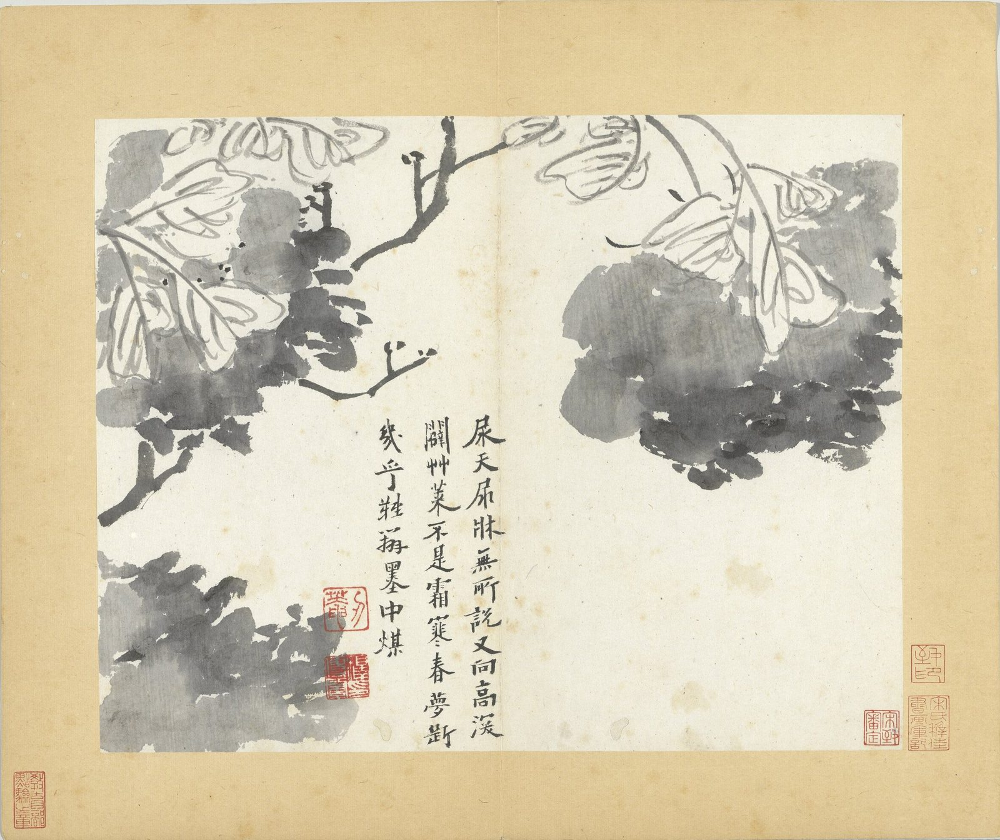
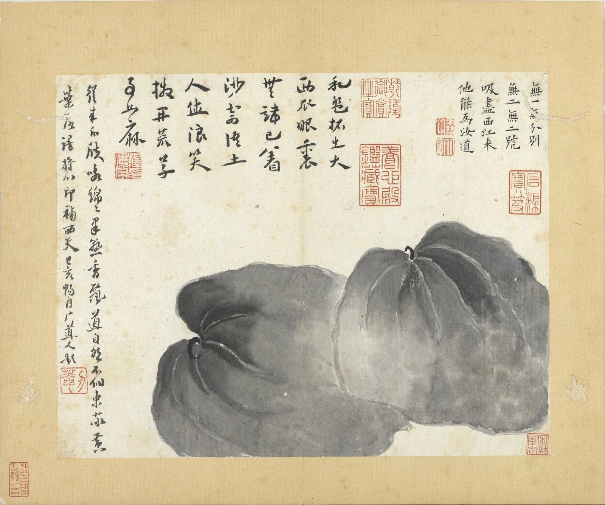
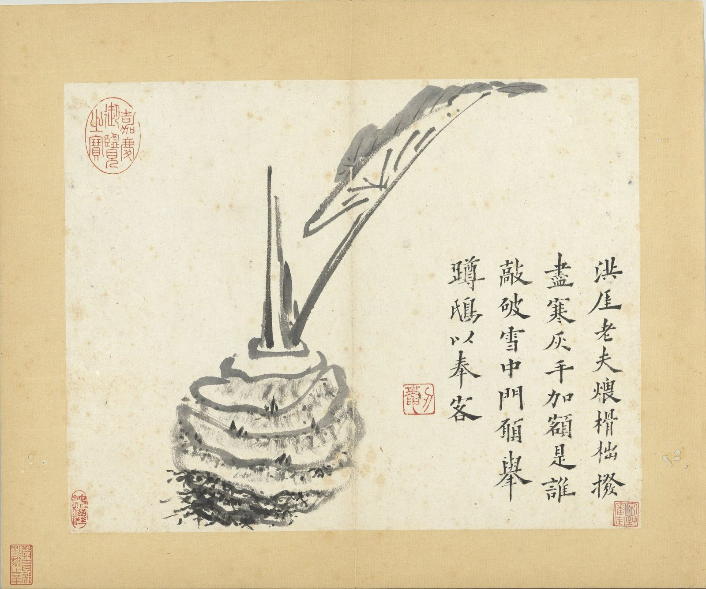
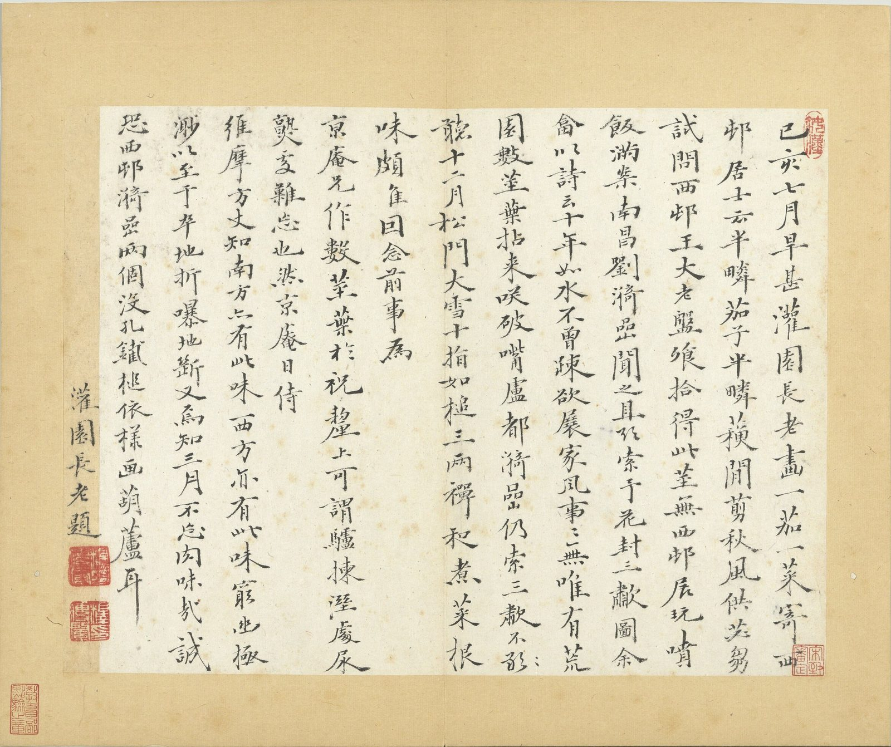
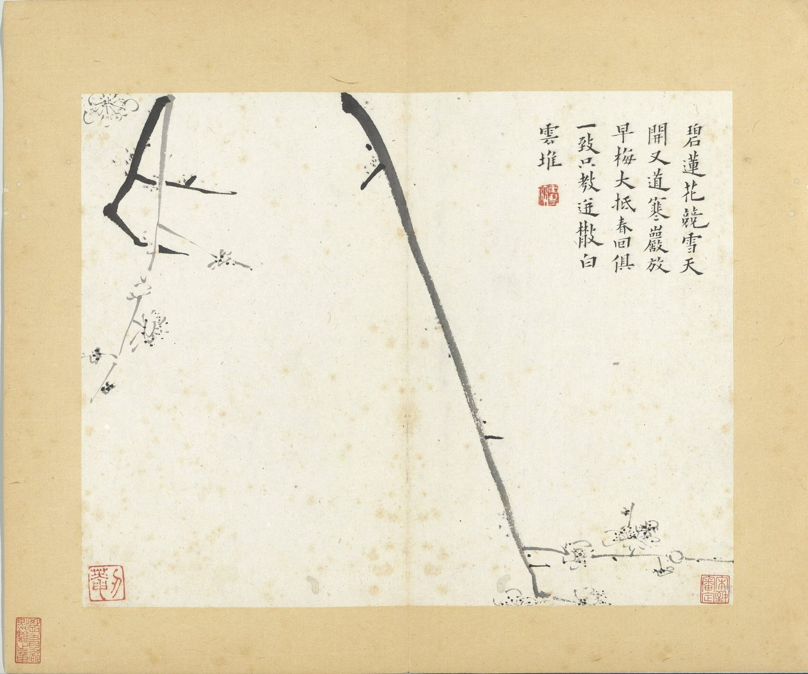
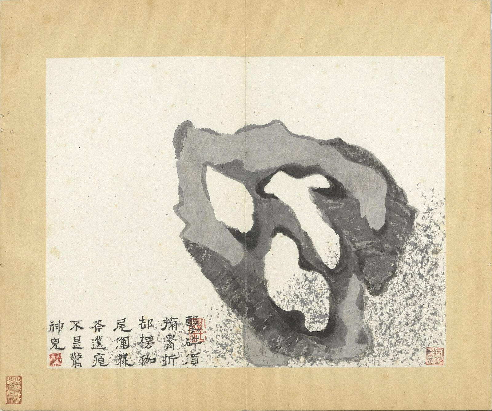
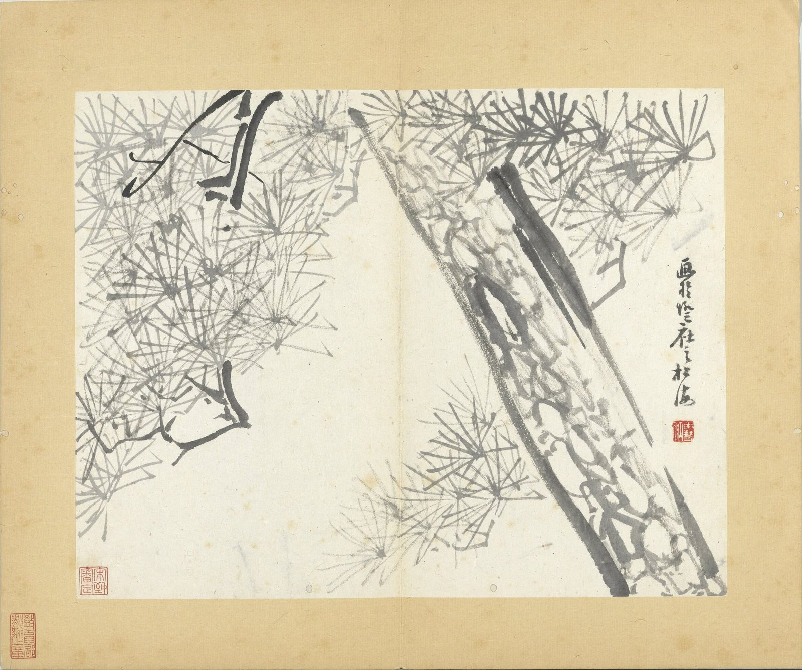
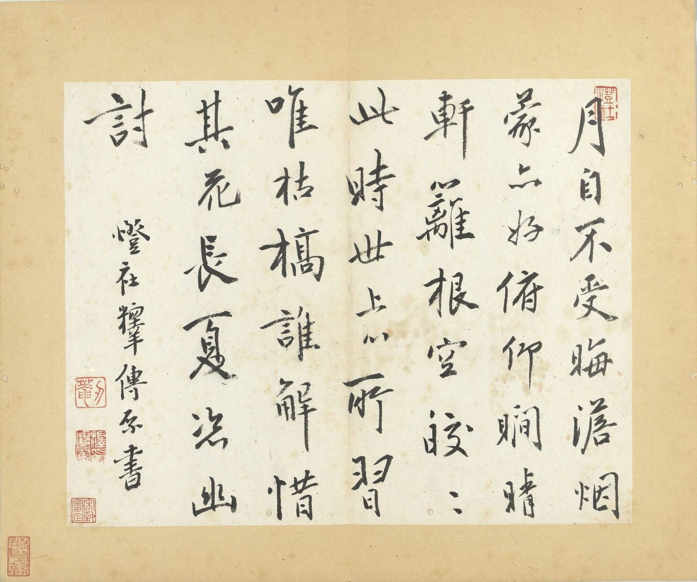
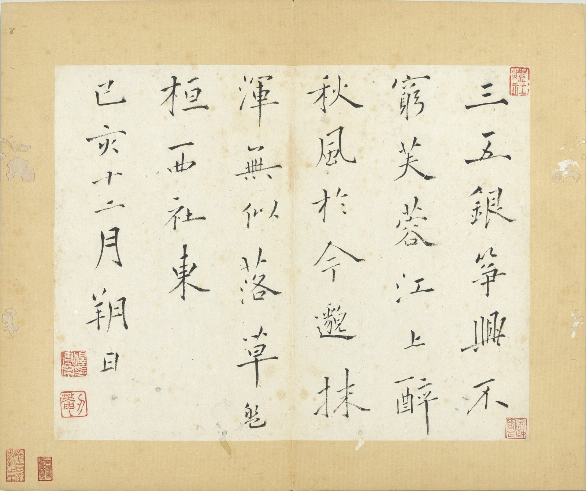

::: {.plate}

每開縱二四．六公分　橫三一．五公分
:::

無一無分別，\
無二無二號。\
吸盡西江來，\
他能為汝道。

印：「雪衲」、「丁字」。

和盤拓出大西瓜，\
眼裡無端已著沙。\
寄語土人休浪笑，\
撥開荒草事如麻。

印：「釋傳綮印」。

從來瓜瓞咏綿綿，\
果熟香飄道自然。\
不似東家黃葉落，\
謾將心印補西天。

己亥暢月广道人題。

印：「刃菴」。

---

洪厓老夫煨榾柮，\
撥盡寒灰手加額。\
是誰敲破雪中門，\
願舉蹲鴟以奉客。

印：「刃菴」、「鈍漢」。

---

己亥七月旱甚。灌園長老畫一茄一菜，寄西村居士云：「半疄茄子半鄰蘇，閒剪秋風供苾芻。試問西村王大老，盤餐拾得此莖無。」西村展玩，噴飯滿案。南昌劉漪喦聞之，且欲索予花封三嘯圖。余畣以詩云：「十年如水不曾疎，欲展家風事事無。唯有荒園數莖葉，拈來笑破嘴盧都。」漪喦仍索三嘯不聽。十二月松門大雪，十指如槌，三兩禪和煮菜根，味頗佳。因念前事，為京庵兄作數莖葉於祝釐上。可謂驢揀濕處尿，熟處難忘也。然京庵日侍維摩方丈，知南方亦有此味，西方亦有此味。窮幽極渺，以至於卒地折，嚗地斷，又焉知三月不忘肉味哉。誠恐西村漪喦兩個沒孔鐵槌依樣畫葫蘆耳。灌園長老題。

印：「鈍漢」、「釋傳綮印」。

---

尿天尿牀無所說，\
又向高深闢草萊。\
不是霜寒春夢斷，\
幾乎難辨墨中煤。

印：「刃菴」、「釋傳綮印」。

---

碧蓮花競雪天開。\
又道寒巖放早梅。\
大抵春回俱一致。\
只教迸散白雪堆。

印：「雪衲」、「刃菴」。

---

擊碎須彌腰。\
折却楞伽尾。\
渾無斧鑿痕。\
不是驚神鬼。

印：「燈社」、「雪衲」。

---

畫於燈社之松海

印：「雪衲」。

---

月自不受晦。澹烟蒙亦好。\
俯仰瞷晴軒。籬根空皎皎。\
此時世上心。所習唯枯槁。\
誰解惜其花。長夏恣幽討。

印：「刃菴」、「燈社」、「釋傳綮印」。

---

三五銀箏興不窮，\
芙蓉江上醉秋風。\
於今邈抹渾無似，\
落草盤桓西社東。

己亥十二月朔日。

印：「刃菴」、「燈社」、「釋傳綮印」。

<!--
本頁圖為第十開「花卉」（牡丹）；冊十五開，國立故宮博物院（台北）藏，故畫001203。題詩、跋文、印記悉據故宮典藏資料檢索釋文（2026-09-07 覆核）：
- 全冊：https://digitalarchive.npm.gov.tw/Collection/Detail/4734?dep=P
- 第一開 西瓜：https://digitalarchive.npm.gov.tw/Collection/Detail/4735?dep=P 三段自題，印記依段分繫：「無一無分別」四句（印：雪衲、丁字）、「和盤拓出大西瓜」四句（印：釋傳綮印）、「從來瓜瓞咏綿綿」四句款「己亥暢月广道人題」（印：刃菴）。館頁釋文作「咏」，從之。「广道人」為八大己亥所用之號。
- 第二開 芋：https://digitalarchive.npm.gov.tw/Collection/Detail/4736?dep=P 「洪厓老夫煨榾柮」四句。印：刃菴、鈍漢。
- 第十開 花卉（本頁圖）：https://digitalarchive.npm.gov.tw/Collection/Detail/4744?dep=P 「尿天尿床無所說。又向高深闢草萊。不是霜寒春夢斷。幾乎難辨墨中煤。」印：刃菴、釋傳綮印。原蹟「床」作「牀」，從原蹟。
- 第三開 己亥七月（長跋）：https://digitalarchive.npm.gov.tw/Collection/Detail/4737?dep=P 原釋文「漪喦仍索三嘯不（敢字點去）聽」，此處依點去後之文。印：鈍漢、釋傳綮印。
- 第十五開 三五銀箏，款「己亥十二月朔日」：https://digitalarchive.npm.gov.tw/Collection/Detail/4749?dep=P 印：刃菴、燈社、釋傳綮印。
- 2026-09-07 只留本人語：刪本站所撰「己亥。余住山十年矣……此其一，牡丹」「人畫牡丹……花黑，葉白」「冊中一紙，記其事」「末葉一絕」「十年如水。家風無可展……其味亦不惡」，及「款署灌園長老、广道人」與他開印文彙列（第四、五、七、九、十一開之款印未錄於正文，館頁連結仍見全冊頁；第一、二開已於 2026-09-10 補入）、尺寸、著錄；description 改為題詩句。
- 2026-09-10 補第一、二開題識：本站〈蔬果卷〉頁註稱「洪厓老夫煨榾柮」四句「本站〈傳綮寫生冊〉頁另有」，補入前該語未見於本站任一頁，其說不實；〈瓜月圖〉頁所去之「從來瓜瓞咏綿綿」四句同屬第一開，一併補錄。二開次序依冊次前移，第十開（本頁圖）改列第三開之後。
- 影像：國立故宮博物院 IIIF 影像 https://iiifod.npm.gov.tw/iiif/2/K2A%2FK2A001203N000000010PAA/full/full/0/default.jpg （其 info.json https://iiifod.npm.gov.tw/iiif/2/K2A%2FK2A001203N000000010PAA/info.json 標 width 3058、height 2289、maxArea 6999762；影像識別碼 K2A001203N000000010PAA 見第十開館頁 https://digitalarchive.npm.gov.tw/Collection/Detail/4744?dep=P 原始碼，典藏號故畫001203）。原檔 3058×2289，冊頁裝裱之外尚有灰底、色階條及「故畫 001203N000000010／清傳綮寫生　冊　花卉」標籤條，三者皆在裝裱以外，裁去，只留裝裱框內（原檔 x 346–2696、y 66–2040），得 2351×1975；圖為第十開全幅連裝裱，題詩、款下「刃菴」「釋傳綮印」二印及裱邊收傳印俱清。舊圖 1492×1318 取自館方已失效之展覽頁，與此同為第十開（牡丹、題詩、印位一一相合），2026-09-10 換。本頁另錄第一、二、三、十五開之題識，四開無圖，館頁連結見上。館方「網站資料開放宣告」 https://digitalarchive.npm.gov.tw/opendata 原文：「開放院藏書畫類、器物類、織品類文物低階圖像（100萬畫素）計約41萬幅，以「公眾領域貢獻宣告」（CC0）規範，不須註明出處。開放院藏書畫類、器物類、織品類文物中階圖像（600萬畫素）計約41萬幅，中階圖檔及本網站文字均以「CC授權條款4.0」之CC BY 姓名標示規範，無須申請、不限用途、不用付費即可公開使用，惟需於適當位置呈現中文或英文姓名標示（選擇一種表示型式），○○○○○為使用圖檔之品名。中文表示型式：○○○○○ 國立故宮博物院，臺北，CC BY 4.0 @ www.npm.gov.tw」。IIIF 全幅檔約 700 萬畫素（info.json 標 maxArea 約 6,999,000），屬中階而非 100 萬畫素之低階，故依 CC BY 標示，不取 CC0；標示句置於圖下，是授權聲明，非編輯文字。本件品名依館頁作「清傳綮寫生　冊　花卉」。
- 2026-09-11 繫年 1659-12：據款「己亥暢月」，干支依八大生卒（1626–1705）定年，陰曆換算用 sxtwl。暢月為十一月，取其月中所當之西曆月。
- 2026-09-12 館方標示句移出圖說，改入 frontmatter `colophon:`，moss 於頁腳列為一行；正文與圖說只留他的字。所用五開之品名並列一句，依館方「○○○○○ 國立故宮博物院，臺北，CC BY 4.0」式。
- 2026-09-12 補第一、二、三、十五開圖版，各置所題之下，檔名 傳綮寫生冊_1／_2／_3／_15.jpg，數即冊次；第十開仍為題圖。四開 IIIF 影像識別碼 K2A001203N000000001PAA、…002PAA、…003PAA、…015PAA（館頁 Detail/4735、4736、4737、4749），全冊十五開 info.json 皆 200，寬 3058、高 2289；裁法同第十開，只留裝裱框內：第一開 x 349–2698、y 83–2044，第二開 x 335–2681、y 85–2044，第三開 x 336–2680、y 78–2044，第十五開 x 354–2700、y 75–2043。
- 2026-09-13 補第十一（白梅）、十二（奇石）、十三（老松）開，置於第十開之後、第十五開之前，依冊次：https://digitalarchive.npm.gov.tw/Collection/Detail/4745?dep=P 「碧蓮花競雪天開。又道寒巖放早梅。大抵春回俱一致。只教迸散白雪堆。」印：雪衲、刃菴；https://digitalarchive.npm.gov.tw/Collection/Detail/4746?dep=P 「擊碎須彌腰。折却楞伽尾。渾無斧鑿痕。不是驚神鬼。」印：燈社、雪衲；https://digitalarchive.npm.gov.tw/Collection/Detail/4747?dep=P 「畫於燈社之松海」印：雪衲。三開 IIIF 影像識別碼 K2A001203N000000011PAA、…012PAA、…013PAA，原檔皆 3058×2289；裁法同前，只留裝裱框內 x 349–2698、y 83–2044，得 2349×1961，檔名 傳綮寫生冊_11／_12／_13.jpg。colophon 品名依序補入白梅、奇石、老松。第十四開「月自不受晦」館頁未見全文釋文，未錄，俟他日核得原詩再補。（2026-09-23 已補，見下。）
- 2026-09-23 圖下注原作尺寸：縱 24.6、橫 31.5 公分（每開），據 https://digitalarchive.npm.gov.tw/Collection/Detail/4734?dep=P。
- 2026-09-23 補第十四開「月自不受晦」：前注謂館頁未見釋文，實則館頁 https://digitalarchive.npm.gov.tw/Collection/Detail/4748?dep=P 釋文欄具錄全詩「月自不受晦。澹烟蒙亦好。俯仰瞷晴軒。籬根空皎皎。此時世上心。所習唯枯槁。誰解惜其花。長夏恣幽討。燈社釋傳綮書。」，作者印記「刃菴」「燈社」「釋傳綮印」，收傳印記「宋致審定」（不錄）。今錄詩與印，款末「燈社釋傳綮書」依本站刪款末署名之例不錄。圖：IIIF 影像識別碼 K2A001203N000000014PAA，原檔 3058×2289，只留裝裱框內 x 351–2692、y 83–2039，得 2341×1956，檔名 傳綮寫生冊_14.jpg；colophon 品名補「月自不受晦」。此開是書非畫，冊中唯此開通幅題詩。
-->
