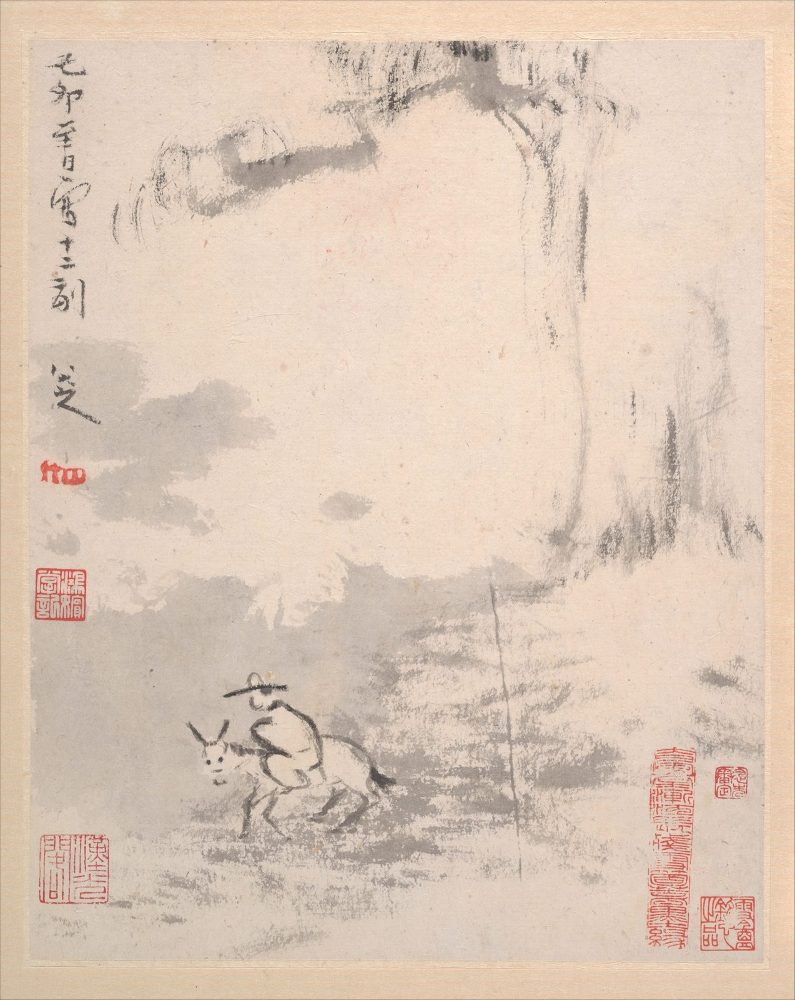

::: {.plate}

縱二三．二公分　橫一八．七公分
:::

己卯至日寫十二副。

印：「八大山人」。

<!--
出處與說明：
- 本頁圖為此冊末開（大都會開放圖像 DP160571），即上文題識所在之開。2026-09-07 換圖：舊用 DP160560（十二幅之首），而正文所錄是末開的題識，圖文不相應，讀來像是題在所見這一開上；今改用題識所在之開。（館方影像未逐幅標開次，首末之說是依 DP160560–DP160571 十二幅之序推得。）末開題「己卯至日寫十二副。八大山人。」——釋文據大都會館頁 https://www.metmuseum.org/art/collection/search/49145 所錄 Inscription：各開署「八大山人寫」或「八大山人」，末開（Leaf L）作「己卯至日寫十二副。八大山人」，Artist's seals 記各開鈐「八大山人」印一方；亦與開放高清圖 https://images.metmuseum.org/CRDImages/as/original/DP160571.jpg 相合。藏號為 1989.363.138a–l（2026-09-07 改，舊記 1989.363.135 者為同館《蓮塘戲禽圖》卷之號，張冠李戴）。此題在同冊末開，屬同一件作品，故留。
- 2026-09-07 再校：正文舊作「印：屐形印」，改從館方著錄作「八大山人」。館方 Artist's seals 只記各開鈐「八大山人」印一方，未及屐形印；本開款下確有小印一方，形如屐，然其印文無刊佈釋文可據，本站不自擬，故正文只錄館方所釋之印。畫幅右下、左下數方為藏印，非八大之印，不錄。
- 2026-09-07 只留本人語：刪去本站以八大口吻自撰的四段（至日是冬至、山頭是圓的、我畫山水很少題字、這一年替人寫冊）；其中「董宗伯」「倪迂」「米家父子」云云出大都會館方說明，非八大語。「河水一擔直三文」雖記為八大己卯年手札語（見書法空間年表 http://www.9610.com/bada/nianbiao.htm ），但年表未錄手札原文，本頁舊稿已自承「化入自述」而非原句，無法核得逐字釋文，故刪。刪去尺寸、藏地、遺贈來源。
- 2026-09-10 刪款末署名：本站即八大山人之地，文末再署一名無所增益，故去之；款中他語一仍其舊。
- 影像：大都會開放圖像 DP160571（ https://images.metmuseum.org/CRDImages/as/original/DP160571.jpg ，館方現行原檔 1497×1881），本站所存亦 1497×1881，館方別無更大之本；館方紀錄（ https://collectionapi.metmuseum.org/public/collection/v1/objects/49145 ）additionalImages 末項即此圖，全幅連裱邊；該紀錄著錄 isPublicDomain: true，屬公有領域，本站圖即館方所出，無需易圖。
- 2026-09-11 繫年 1699-12-21：據款「己卯至日」，干支依八大生卒（1626–1705）定年，陰曆換算用 sxtwl。至日即冬至，康熙三十八年冬至為 1699 年 12 月 21 日（依節氣推算）。
- 2026-09-23 圖下注原作尺寸：縱 23.2、橫 18.7 公分（本幅，不計裝裱），據 https://collectionapi.metmuseum.org/public/collection/v1/objects/49145；https://www.metmuseum.org/art/collection/search/49145。
-->
