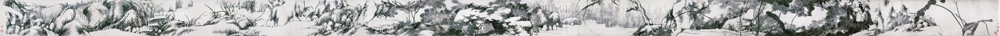
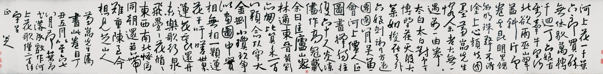

::: {.plate}

畫心縱四七公分　橫一二九二．五公分
:::

河上花，一千葉，六郎買醉無休歇。\
萬轉千迴丁六娘，直到牽牛望河北。\
欲雨巫山翠蓋斜，片雲卷去昆明黑。\
饋而明珠擎不得，塗上心頭共團墨。\
蕙嵒先生憐余老大無一遇，萬一由拳拳太白。\
太白對予言：博望侯，天般大，葉如梭，在天外，六娘劍術行方邁。\
團圞八月吳兼會，河上仙人正圖畫。\
撐腸拄腹六十尺，炎涼盡作高冠戴。\
余曰：匡廬，山密林邇，東晉黃冠亦朋比，算來一百八顆念頭穿。\
大金剛，小瓊玖，爭似圖畫中。\
實相無相，一顆蓮花子。\
吁嗟世界蓮花裏。\
還舟未？樂歌行，泉飛疊疊花循循。\
東西南北怪底同，朝還並蒂難重陳，至今想見芝山人。

蕙嵒先生屬畫此卷。自丁丑五月以至六、七、八月荷葉荷花落成。戲作河上花歌僅二百餘字呈正。

<!--
- 卷末自跋「蕙嵒先生屬畫此卷。自丁丑五月以至六、七、八月荷葉荷花落成。戲作河上花歌僅二百餘字呈正。八大山人。」：澎湃新聞〈國際博物館日｜13米的八大山人《河上花》全卷呈現天津〉 https://m.thepaper.cn/detail/27427123 ；搜狐〈八大山人12米花卉長卷〉 https://www.sohu.com/a/672721976_121124308 ；百度百科「河上花圖」條 https://baike.baidu.com/item/%E6%B2%B3%E4%B8%8A%E8%8A%B1%E5%9B%BE/7824363 。舊文作「囑畫」，依釋文改「屬畫」。卷上《河上花歌》全文另見本站〈河上花歌〉頁。
- 引首徐世昌「寒煙淡墨如見其人」、拖尾永瑆及徐世昌跋、徐世昌鑑藏印，皆非八大手筆，不錄。
- 2026-09-07 只留本人語：刪本站所撰山人口吻自述全部（「這是卷尾的跋」至「他帶回揚州去了」），內含化自〈河上花歌〉「蕙嵒先生憐余老大無一遇」「實相無相，一顆蓮花子。吁嗟世界蓮花裏」之轉引（原句留在〈河上花歌〉頁，本幅正文不重出），及尺寸、藏地、年歲推算、蕙嵒生平（朱良志文 https://fh.pku.edu.cn/docs/2018-11/20181108110713235080.pdf ）、南開序文 https://art.nankai.edu.cn/2013/0630/c11137a112361/page.htm 等注；description 改為跋語本句。
- 2026-09-10 刪款末署名：本站即八大山人之地，文末再署一名無所增益，故去之；款中他語一仍其舊。
- 2026-09-10 圖版出處與所攝何段。本頁圖檔為維基共享資源 File:清 朱耷 河上花圖卷 HX1.jpg 之縮存（原檔 8906×6573 像素，來源標作 115.com，標記 PD-Art） https://commons.wikimedia.org/wiki/File:%E6%B8%85_%E6%9C%B1%E8%80%B7_%E6%B2%B3%E4%B8%8A%E8%8A%B1%E5%9C%96%E5%8D%B7_HX1.jpg ，該卷之圖檔共二十一段（HX1–HX21，另有引首、背面、盒簽各檔），此其第一段。畫心縱 47、橫 1292.5 公分，此段當卷首約六十餘公分，約全畫二十分之一，故所見止一荷葉自左緣入而中斷，右三分之一為畫前空紙，紙上鈐近人鑑藏印四方——舊注「卷首一段」「近人鑑藏印四方」不誤，今補其為全卷幾分之幾，免讀者以局部為全豹。按藝術品本身早入公有領域（八大山人歿於一七〇五），攝影一層則據 PD-Art 之見解，非天津博物館之授權；天津博物館館頁（正確網域為 tjbwg.cn，非 tjbwg.com）footer 作「版權所有」，且其自載圖檔連結已失效 https://www.tjbwg.cn/cn/collectionInfo.aspx?Id=2616 。
- 2026-09-10 全卷之裝池次第，據天津博物館館頁（同上）及南開大學〈八大山人《河上花圖卷》序〉 https://art.nankai.edu.cn/2013/0630/c11137a112361/page.htm ：引首徐世昌行書「寒煙淡墨如見其人」，畫心，卷末八大自賦《河上花歌》行草三十七行及自跋，拖尾永瑆、許乃普、徐世昌三跋。畫心 1292.5 公分，連裝池全長近二十公尺。引首署款鈐印經覆核為徐世昌（署「弢齋」，鈐「弢齋」「徐世昌印」），南開文作「徐世章」，與實物不合，不從。卷末自賦之圖版見本站 文/河上花歌。
- 2026-09-11 繫年 1697-09：據款「自丁丑五月以至六、七、八月荷葉荷花落成」，干支依八大生卒（1626–1705）定年，陰曆換算用 sxtwl。畫成於八月，取八月月中所當之西曆月，與 文/河上花歌 同。
- 2026-09-23 圖下注原作尺寸：縱 47、橫 1292.5 公分（全卷畫心），據 https://m.thepaper.cn/detail/27427123；https://art.nankai.edu.cn/2013/0630/c11137a112361/page.htm。
- 2026-09-23 換全卷：舊圖只是卷首一段（HX1，約全畫二十分之一）。今以維基共享資源 HX1–HX21 二十段（PD-Art）逐段對縫拼合全卷畫心；其中 HX8 一段從未上傳，取同源之全卷圖 File:八大山人 河上花图.jpg（50496×1644，標 Public domain，源 yihua.art） https://upload.wikimedia.org/wikipedia/commons/e/e8/%E5%85%AB%E5%A4%A7%E5%B1%B1%E4%BA%BA_%E6%B2%B3%E4%B8%8A%E8%8A%B1%E5%9B%BE.jpg 相應部分補足，按兩鄰段定比例、校色調。成圖 38324×1400，縱橫比 27.37（館載 47×1292.5 公分，27.5）；二十處接縫逐一目驗筆墨連貫、無重影缺條。上下裁至紙邊，去綾邊。卷末自賦《河上花歌》及跋在另紙，見本站 文/河上花歌，不入此圖。目錄縮圖 河上花圖_cover.jpg 取卷首荷葉一段。前注「本頁圖為卷首一段」云云，今已不然。
- 2026-09-23 補歌：卷末八大自賦《河上花歌》與自跋同屬此卷，今錄歌全文於跋前（依卷次：畫、歌、跋），釋文與本站 文/河上花歌 同，出處見該頁；前注「原句留在〈河上花歌〉頁，本幅正文不重出」之決定今改。圖版於畫後接歌之原跡。
- 2026-09-23 重裁兩端：前版左右恰裁在紙邊，兩端鑑藏印（右四方、左二方）皆被截半，站主指出畫似仍略有裁切。今兩端各外延約七十像素，印全見，並留少許鄰紙；上下原已至紙之全高，與維基全卷圖比對無損。成圖 38415×1400。
- 2026-09-23 補歌之原跡：圖版於畫後接卷末自賦《河上花歌》及自跋，維基共享資源 File:清 朱耷 河上花圖 跋文 1 1.jpg 至 1 4.jpg 四紙原檔（PD-Art）依卷次相接為一幅，四紙彼此不重疊、上下無錯位；紙色依畫心調至相近。成圖 11317×1400，止於八大自跋與款，後人跋不入。兩端鑑藏印騎縫者原攝影即截於圖外，無他本可補。尺寸注改作「畫心」，歌紙尺寸未見著錄。
-->
