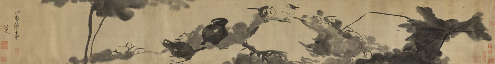

::: {.plate}

縱二七．三公分　橫二〇五．一公分
:::

山房涉事。

印：「涉事」、「八大山人」、「八大山人」。

<!--
出處與說明：
- 自題「山房涉事」（行書）、款「八大山人」：朱良志〈八大山人的「涉事」哲學〉（轉載 https://www.sohu.com/a/678548629_121124389 ）記紐約大都會藝術博物館藏《山房涉事圖》卷（即《蓮塘戲禽圖》卷）「從落款『八大山人』的『八』的書寫情況看……此作八大款中有『山房涉事』語」。卷末圖版見 Wikimedia Commons「清 八大山人 （朱耷） 蓮塘戲禽圖 卷-Birds in a lotus pond MET DP205837 38.jpg」，四字行書與款相符。館頁 https://www.metmuseum.org/art/collection/search/49143 錄 Inscription「山房涉事／八大山人」（Artist's inscription and signature, 2 columns in semi-cursive script）及 Artist's seals「涉事／八大山人／八大山人」，館方未標朱白。張大千題籤、藏印不錄。本頁圖檔為全卷中段（八哥一段），與 Commons「File:Bada Shanren (Zhu Da) - Birds in a lotus pond - 1989.363.135 - Metropolitan Museum of Art.jpg」同源。
- 2026-09-07 只留本人語：刪去本站以八大口吻自撰的全部段落（卷尾就這四個字、綾吸墨快、卷子從右邊看起、鳥的眼睛畫成一圈一點、捲起來一手可握等），其中構圖描述本自館方說明，「綾吸墨」本自館方「highly absorbent medium of satin」，皆非八大語；刪去材質、尺寸、繫年、藏號及指向〈落花圖〉頁的「涉事」釋義。description 改為自題「山房涉事」。
- 2026-09-07 再校：舊稿一度以「館頁與 API 均無釋文」為由刪去印文一行，誤——無此二欄的是開放 API，館頁有；館頁本身當日未能取得，遂誤以 API 之闕為館方之闕。今經 web.archive.org 存檔（20260118165634）覆核，款識、印文俱在，三印補回。張大千題籤（「八大山人《蓮塘戲禽圖》，大風堂供養」）及藏印仍不錄。
- 2026-09-10 刪款末署名：本站即八大山人之地，文末再署一名無所增益，故去之；款中他語一仍其舊。
- 2026-09-10 易圖：舊圖為全卷中段（八哥一段），不見款印。大都會開放 API（https://collectionapi.metmuseum.org/public/collection/v1/objects/49143 ）additionalImages 列卷末一段之官方影像 DP205837_38（https://images.metmuseum.org/CRDImages/as/original/DP205837_38.jpg ），「山房涉事」四字、八大山人款及「涉事」「八大山人」「八大山人」三印俱在，故易以此圖，取其與本頁釋文所據同一物、同一段。
- 影像：大都會官方影像 DP205837_38（https://images.metmuseum.org/CRDImages/as/original/DP205837_38.jpg ，object 49143／1989.363.135 之 additionalImages 一），本頁圖 2029×935，係該檔經本站重存；API 該物件 `isPublicDomain` 欄作 `true`；影像權利據館方開放 API 同物件 isPublicDomain: true；館方 Open Access 政策頁 https://www.metmuseum.org/about-the-met/policies-and-documents/open-access 未能取得，其文未錄。
- 2026-09-11 繫年 1690：大都會著錄 ca. 1690（objectBeginDate 1680／objectEndDate 1700），從館方。出處 https://collectionapi.metmuseum.org/public/collection/v1/objects/49143。
- 2026-09-11 繫月 1690-06：大都會藝術博物館著錄 ca. 1690（objectBeginDate 1680／objectEndDate 1700），月無可考，取全年之中月，是估計。
- 2026-09-23 圖下注原作尺寸：縱 27.3、橫 205.1 公分（全卷畫心），據 https://collectionapi.metmuseum.org/public/collection/v1/objects/49143。
- 2026-09-23 換全卷：舊圖只是卷末一段（大都會 DP205837_38，「山房涉事」款印處），今以館方開放檔案（CC0）五幅局部 DP205838、DP205837_38、DP205836、DP205835、DP205834 對照全卷照 DP-19449-001 逐幅定位拼合為全卷畫心，10605×1400，縱橫比 7.58（館載 27.3×205.1 公分，7.51）；四處接縫逐一目驗筆墨連貫、無重影缺條。DP205837_38 所攝一段（約全長 17%，蓮苞一帶）解析度較他段低，放大 1.55 倍。舊圖留作目錄縮圖 荷花禽鳥圖_cover.jpg。
-->
