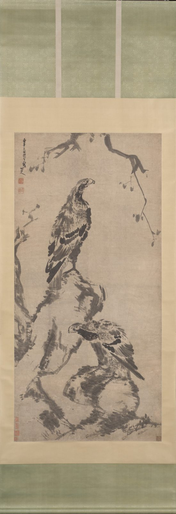

::: {.plate}

縱一八七．三公分　橫九〇．二公分
:::

壬午三月既望寫。

印：「八大山人」、「何園」、「真賞」。

<!--
紐約大都會藝術博物館藏《二鷹圖》軸，2014.721，壬午（1702）。
- 款「壬午三月既望寫。八大山人」、印三方：大都會館頁 https://www.metmuseum.org/art/collection/search/39540 錄 Inscription「壬午三月既望寫。八大山人」，Artist's seals「八大山人／何園／真賞」（開放 API https://collectionapi.metmuseum.org/public/collection/v1/objects/39540 無此二欄，網頁有；2026-09-07 經 web.archive.org 存檔覆核）。2026-09-07 據此改正兩處：舊作「既望次日寫」，衍「次日」二字——既望已指望日之次日，館方英譯「the day after the full moon」正是釋「既望」，舊稿誤以英譯為額外一日；又舊只錄二印，漏「真賞」。館方未標朱白，故不記印色。館方另錄外籤「雪個道人《靈鷲圖》，神品」，非八大語，不錄。
- 畫左下王季遷等藏印非山人筆，不錄。
- 2026-09-07 只留本人語：刪本站所撰「既望次日，就是十七……」「紙很大……」「鷹的翎我用側筆掃……」「畫鷹的舊法是林良的……」（據大都會館方說明改寫）「款下兩方印……何園是我這一年新刻的……」（據年表），及館藏、尺寸、他本考證；description 改為款中語。
- 2026-09-10 刪款末署名：本站即八大山人之地，文末再署一名無所增益，故去之；款中他語一仍其舊。
- 影像：大都會藝術博物館開放圖像 DP-19468-001（ https://images.metmuseum.org/CRDImages/as/original/DP-19468-001.jpg ，館方藏品頁 https://collectionapi.metmuseum.org/public/collection/v1/objects/39540 ），原檔 1506×3962，連裱、天地杆、掛繩之掛軸全形；四周攝影黑底裁去，左 36、上 32、右 1480、下 3916（PIL crop，量化表與取樣仍舊），得 1444×3884。館方著錄「isPublicDomain」欄作 true，公版無疑。2026-09-13 換圖：舊圖用館方所贈維基共享資源檔 DP157282（2454×4000），舊文誤稱「全幅連裱，不裁邊」——DP157282 實亦僅畫心，非連裱全器，誤同蘭亭序頁換圖前所記；今改用館方 DP-19468-001，方是連裱全形，畫心部分款印仍可辨。 2026-09-13 再裁去殘留黑底：1308×3805
- 2026-09-11 繫年 1702-04-12：據款「壬午三月既望」，干支依八大生卒（1626–1705）定年，陰曆換算用 sxtwl。既望為十六日；館方（大都會）繫 1702 年 4 月 12 日，與換算同。
- 2026-09-23 圖下注原作尺寸：縱 187.3、橫 90.2 公分（本幅，不計裝裱），據 https://collectionapi.metmuseum.org/public/collection/v1/objects/39540。
-->
