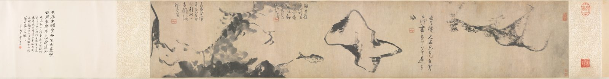

::: {.plate}

縱二九．六公分　橫一五八．四公分
:::

去天纔尺五，只見白雲行。\
云何畫黃花，雲中是金城。

---

雙井舊中河，明月時延佇。\
黃家雙鯉魚，為龍在何處。

---

三萬六千頃，畢竟有魚行。\
到此一黃頰，海潮次上笙。

印：每詩後屐形印（「个山」）一方。

<!--
克里夫蘭美術館藏，1953.247。
- 三詩釋文據克里夫蘭美術館館藏記錄 https://www.clevelandart.org/art/1953.247 （開放資料 API https://openaccess-api.clevelandart.org/api/artworks/1953.247 ，inscriptions 欄位）；對照本頁圖，三詩每句五字，「天」「尺」之間確是「纔」字。每詩後鈐屐形印（个山）一方；第三詩右上另有藏印一方，不錄。
- 卷末張大千壬申跋非山人筆，不錄。
- 影像：https://commons.wikimedia.org/wiki/File:Bada_Shanren_(Chinese,_1626-1705)_-_Fish_and_Rocks_-_1953.247_-_Cleveland_Museum_of_Art.jpg ，維基共享資源標記 PD-Art (PD-old-auto-expired)，藏館 Cleveland Museum of Art。
- 2026-09-07 只留本人語：刪本站所撰三詩之後的釋意四段「卷從一座山頭起……」「往左是一塊石……」「再往左……」「每首詩後面我按一方印……」（典故據館方註釋），及館藏、尺寸、流傳；description 改為詩句。
- 2026-09-11 繫年 1677：無款年。克里夫蘭美術館僅著錄 mid- to late 1600s；詩後鈐屐形「个山」印，个山之號用於辛亥（1671）至甲子（1684）改署八大山人前（見 全站「印與名號」一頁），取其中年，是估計。
- 2026-09-11 繫月 1677-06：克里夫蘭美術館僅著錄 mid- to late 1600s，年份已依个山印年（辛亥 1671–甲子 1684）取中 1677（見上），月無可考，同法取全年中月，是估計。
- 2026-09-23 圖下注原作尺寸：縱 29.6、橫 158.4 公分（本幅，不計裝裱），據 https://openaccess-api.clevelandart.org/api/artworks/1953.247；https://www.clevelandart.org/art/1953.247。
-->
