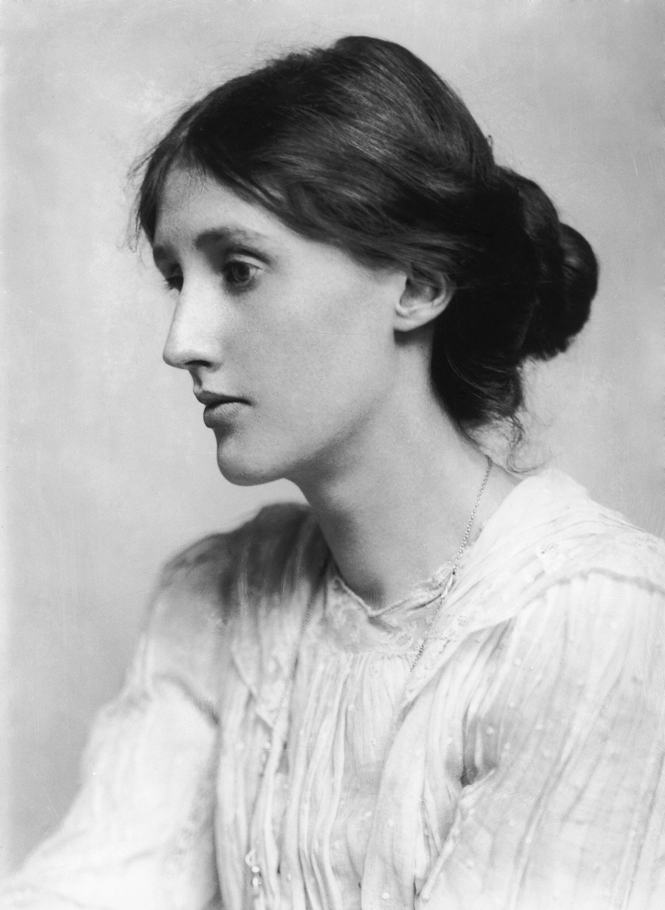

There is a sentence in Dr. Johnson’s Life of Gray which might well be written up in all those rooms, too humble to be called libraries, yet full of books, where the pursuit of reading is carried on by private people. “. . . I rejoice to concur with the common reader; for by the common sense of readers, uncorrupted by literary prejudices, after all the refinements of subtilty and the dogmatism of learning, must be finally decided all claim to poetical honours.” It defines their qualities; it dignifies their aims; it bestows upon a pursuit which devours a great deal of time, and is yet apt to leave behind it nothing very substantial, the sanction of the great man’s approval.

The common reader, as Dr. Johnson implies, differs from the critic and the scholar. He is worse educated, and nature has not gifted him so generously. He reads for his own pleasure rather than to impart knowledge or correct the opinions of others. Above all, he is guided by an instinct to create for himself, out of whatever odds and ends he can come by, some kind of whole—a portrait of a man, a sketch of an age, a theory of the art of writing. He never ceases, as he reads, to run up some rickety and ramshackle fabric which shall give him the temporary satisfaction of looking sufficiently like the real object to allow of affection, laughter, and argument. Hasty, inaccurate, and superficial, snatching now this poem, now that scrap of old furniture without caring where he finds it or of what nature it may be so long as it serves his purpose and rounds his structure, his deficiencies as a critic are too obvious to be pointed out; but if he has, as Dr. Johnson maintained, some say in the final distribution of poetical honours, then, perhaps, it may be worth while to write down a few of the ideas and opinions which, insignificant in themselves, yet contribute to so mighty a result.

- Books: *The Voyage Out*, 1915; *Night and Day*, 1919; *Jacob's Room*, 1922; *Mrs Dalloway*, 1925; *The Common Reader*, 1925; *To the Lighthouse*, 1927; *Orlando*, 1928; *A Room of One's Own*, 1929; *The Waves*, 1931; *The Common Reader: Second Series*, 1932; *Flush*, 1933; *The Years*, 1937; *Three Guineas*, 1938; *Between the Acts*, 1941
- Editions: *The Common Reader*, First Series (Hogarth Press / Harcourt, Brace and Company, 1925); *A Room of One's Own* (Hogarth Press, 1929); *The Voyage Out* (Duckworth, 1915; public domain in the United States; this text: Project Gutenberg #144); *Monday or Tuesday*, containing "Kew Gardens" (Hogarth Press, 1921; public domain in the United States; this text: Project Gutenberg #29220); *Jacob's Room* (Hogarth Press, 1922; public domain in the United States; this text: Project Gutenberg #5670); *Mrs Dalloway* (Hogarth Press, 1925; public domain in the United States; this text: Project Gutenberg of Australia #0200991); *Orlando: A Biography* (Hogarth Press, 1928; public domain in the United States; this text: Project Gutenberg of Australia #0200331); "Haworth, November 1904" (The Guardian, 21 December 1904); "To Spain" (Nation and Athenaeum, 5 May 1923); "Street Haunting: A London Adventure" (The Yale Review, October 1927); "A Walk by Night" (The Guardian, 28 December 1905 — unsigned; attribution to Woolf is scholarly and almost certain, not confirmed by a byline, per S. P. Rosenbaum, *Virginia Woolf Miscellany* no. 26, 1986); "How Should One Read a Book?" (read as a paper at Hayes Court, Kent, 30 January 1926; printed in The Yale Review, October 1926); "Mr. Bennett and Mrs. Brown" (read to the Heretics Society, Cambridge, 18 May 1924; printed as "Character in Fiction" in The Criterion, July 1924; Hogarth Press pamphlet, 30 October 1924, Project Gutenberg #63022)
- Public domain: United States; countries with a copyright term of life plus 70 years or less
- Type: Fraunces, Literata
